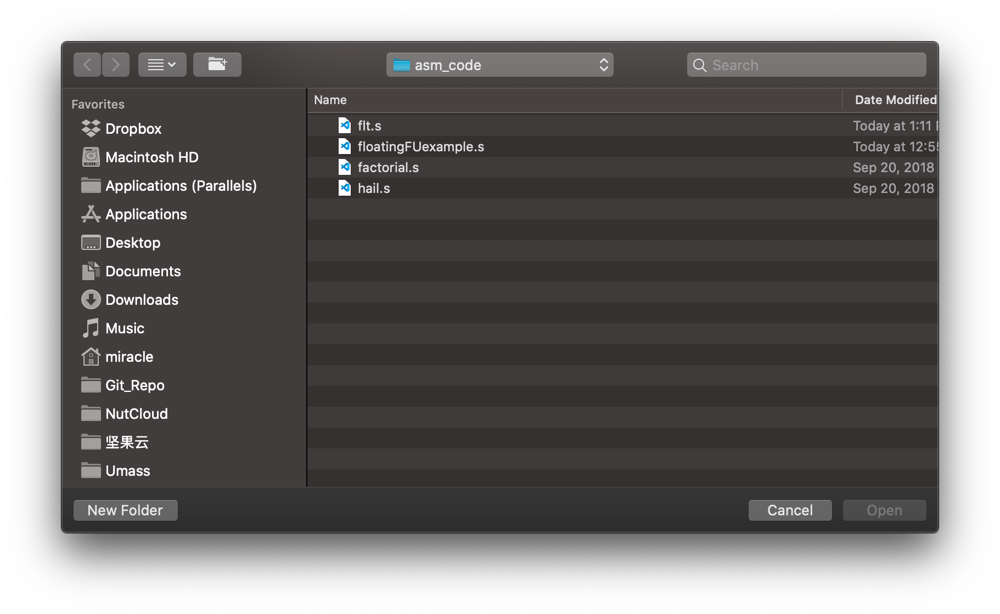

# Tomasulo-Visual

If you are just learning Tomasulo algorithm, please don't miss this repo, it will show you how it works in a quite straightforward way. 

This is a visualization project of Tomasulo algorithm which make it easier to understand the algorithm. It can read a `*.s` asm file and parse it, and you can execute instructions according to Tomasulo algorithm. This project is mainly for study use and it will not really parse the instruction to binary and it just briefly translate all of the instructions to a set of characterized classes and assign a separate execute function to each class. 

This project is a course project, the course is Umass Amherst ENG668-Computer Architecture. Because we only get one and a half month to develop such a big program, it is inevitable to have some potential bugs inside, and the function is not fully complete. It is only supposed to be used for educational purpose. If you like this project or you want to develop on the top of it, please start [this repo](https://github.com/miracleyoo/Tomasulo-Visual/). Although I will not maintain this repo afterward, I welcome any **pull request** if you have make any further progress.

## File Structure

`asm_code/`: Sample asm code for test.

`Assets/`: UI related images and screen captures.

`src/com/miracleyoo/Logic/MainLogic.java`: Main logic. All of the important global variables are placed here and you can go into the code to read the very detailed comment of every variable. Also, the whole logic and related functions under the `Execute step` can be find here.

`src/com/miracleyoo/UIs/CoolMainUI.java`: The welcome page. It is boarder-less, image-based and mouse-movable. It will guide you to select a file to execute. More detailed introduction can be find below in the screen capture's explanation.

`src/com/miracleyoo/UIs/DataUI.java`: The most important UI, we mostly work here and it will show us a cycle table, register table, tomasulo dynamic chart, statistics and data table.

`src/com/miracleyoo/UIs/Diagram.java`: Tomasulo Dynamic Chart's implementation. All manually draw graphic components.

`src/com/miracleyoo/UIs/ArchitectureCycleUI.java`: UI that takes the input of cycle numbers of each type of function unit.

`src/com/miracleyoo/UIs/ArchitectureNumUI.java`: UI that takes the input of exact numbers of each type of function unit.

`src/com/miracleyoo/UIs/MultiStepsUI.java`: UI that takes the "multi" of "multi step".

`src/com/miracleyoo/UIs/InfoUI.java`: UI that shows the info of program and authors.

`src/com/miracleyoo/utils/ParseFile.java`: The parser of asm files.

`src/com/miracleyoo/utils/UICommonUtils.java`: Some utils for UI layout.

`src/com/miracleyoo/utils/TableUtils.java`: Responsibile for the highlights of the cycle table.

`src/com/miracleyoo/utils/NoneFrame.java`: Support class for the boarder-less UI.

`src/com/miracleyoo/utils/BackgroundPanel.java`: Support class for the image-based UI.

## Main Logic Workflow

```

          Initialize data structures and dictionaries
                            ↓
                Parse the next instruction
                            ↓
               Judge whether it can be issued now
                            ↓
  Update the Information for the newly issued instruction (like issue cycle)
                            ↓
  Sequentially check all of the instructions in the Operands station now,
         And do corresponding operation to them according to state
          ↓               ↓                   ↓               ↓
 | check can exe | check can exeEnd |  check can WB |  check can end |
          ↓                                   ↓               ↓
          ↓                                 ExeOps          EndOps
          ↓
  OpsNOP / OpsADD / OpsSUB / OpsMUL / OpsDIV / ......
                            ↓
                         cycle ++
```

## Attention

This project **DO NOT DECODE INSTRUCTIONS TO BINARY**. It only parse the instruction by its string and simulate the execution based on the parsed results. I.E. It is not a full version emulator, it may not work in some cases, in some special asm files, and it is only for the educational use. 

There may still be some bugs, and we do not promise the correctness of the result. Please take it as a reference only. Also, not all of the class type execution function has been implemented, some unimportant types are left empty. If you want to use it seriously, please implement these functions yourself.

Since we do not decode instructions to binary, so it cannot locate, load and save the actual value in the memory. Here we use a virtual memory to simulate the memory access. The virtual memory will be randomly initialized and load and save operation happen here. It is enough for demonstration use. For the same reason, the `.data` part of the input asm file will not really be decoded.

Please use **Math-only asm files** if you want to make your own input `*.s` file, since strings related functions are not considered. When you write branch operation, please make sure the branch destination is a label rather than a register, since program cannot know the actual address.

Although I've said a lot on its disadvantage, it is still easy to use and enough for educational purpose. Have fun!

## Some screen captures and introduction

At first the welcome page, it will guide the user open a file ends with `*.s` and parse the file and pass it to Data UI.


You will be able to select files you want to parse here, it will be originally set to the `./asm_code` folder, you can change the default setting if you want, in the `CoolMainUI` code. This folder contains 4 asm files which are already tested and they work properly.


Here is the DataUI, this UI contains the most of the UI content and it includes a Cycle Table, a Tomasulo Diagram, a Registers Table, a Data Table and a Statistics. They will all update properly as you click the `Execute 1/multiple Step` button. One thing to mention is that the Tomasulo Dynamic Chart is drew manually, and it will always be in the center view. 


Here is a screen capture of a file being executed halfway, and you can see cycles and Tomasulo Graph can work according to the Tomasulo theory and each instruction will have a special highlight color, both in cycles table and in Tomasulo Dynamic Chart. You can track every instruction by its color. All there items will update as you click button.


This is the state when all the instruction of a asm file has been finished. The Op Queue is empty and all of the Cycle table items are filled with specific cycle stage number.


This is the input panel where user can input the cycle number needed for the completion of an operation for each kind of function unit. The program will be reset but with the same input file when you change some items here, since the structure changes and program need to restart.


This is the input panel where user can input the number of each kind of function unit, you can see the change of FU number in Tomasulo Dynamic Chart and Statistics. The program will be reset but with the same input file when you change some items here, since the structure changes and program need to restart.


You may have noticed that in the bottom right corner there is an button named `Execute multiple steps`, and the input page here is for defining the `multi`.


Here is the help or information page. You will find basic information about the program and its authors here.


Also, the program has two themes! Light and Dark mode are supported. They will change smoothly and nothing will be reset. In fact I prefer the dark mode more. The default mode can be changed in the `MainLogic.java` file.


## More Detailed Information in Presentation Slides


ReadMe authors: **Zhongyang, Vignesh**


